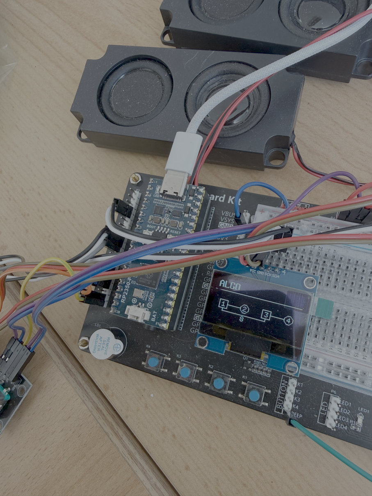

# PicoVintageSynthCollection

Ten vintage synthesizer emulations for the RP2350, built from one shared
codebase. Same board, same core, one firmware image per instrument.

<p align="center">
  
</p>

## Demo

<p align="center">
  <a href="https://youtu.be/cG6gyhaqCxE">
    
  </a>
  <br>
  <a href="https://youtu.be/cG6gyhaqCxE">&#9654; Demo video on YouTube</a>
</p>

## Instruments

| Folder | Instrument | Binary |
|---|---|---|
| [instruments/PicoFaceYC](instruments/PicoFaceYC/README.md) | Yamaha reface YC (drawbar organ) | PicoFaceYC.uf2 |
| [instruments/PicoFaceCP](instruments/PicoFaceCP/README.md) | Yamaha reface CP (electric piano, mdaEPiano) | PicoFaceCP.uf2 |
| [instruments/PicoFaceDX](instruments/PicoFaceDX/README.md) | Yamaha reface DX (4-operator FM) | PicoFaceDX.uf2 |
| [instruments/PicoFaceJ6](instruments/PicoFaceJ6/README.md) | Roland Juno-6 | PicoFaceJ6.uf2 |
| [instruments/PicoFaceMD](instruments/PicoFaceMD/README.md) | Minimoog Model D | PicoFaceMD.uf2 |
| [instruments/PicoFaceSM](instruments/PicoFaceSM/README.md) | ARP/Eminent Solina String Ensemble | PicoFaceSM.uf2 |
| [instruments/PicoFaceOB](instruments/PicoFaceOB/README.md) | Oberheim OB-X (engine ported from OB-Xf) | PicoFaceOB.uf2 |
| [instruments/PicoFaceRD](instruments/PicoFaceRD/README.md) | Roland RD / MKS-20 (sample piano) | local build only |
| [instruments/PicoFaceJV](instruments/PicoFaceJV/README.md) | Roland JV-880 (native engine over the original PCM data) | local build only |
| [instruments/PicoFaceD5](instruments/PicoFaceD5/README.md) | Roland D-50 (native LA engine over the original PCM data) | local build only |

The RD, the JV-880 and the D-50 are the exceptions to "download and flash":
they only build where the respective ROM set is present, and those ROMs are not
distributable, so none of the three is in the release binaries. Without them
the configure step skips them and the seven above are unaffected. All three run
on the hardware; see the flash note below for the one build option the JV-880
needs on a small board.

## Hardware

- RP2350 with 16 MB of flash
- I2S audio (PCM5102 DAC)
- 128x64 OLED over I2C (SH1106)
- Three rotary encoders with push buttons
- USB MIDI and DIN MIDI

The pin map is the same for every instrument and lives in
[core/include/project_config.h](core/include/project_config.h).

**If the screen stays dark.** The panel is on I2C at 1 MHz with only the chip's
internal pull-ups. That is above what an SH1106 datasheet promises (400 kHz) and
it is what the reference board runs, because the display push is paced in half
tile rows of roughly 1.5 ms of I2C each -- the bus rate is directly the UI's
frame time, and 400 kHz would make a full screen 60 ms instead of 24. On longer
jumper leads it is the first thing to suspect. Build with
`-DPICOFACE_OLED_I2C_HZ=400000`, and consider real 2.2k-4.7k pull-ups before
blaming the display.

A display that is simply absent costs nothing: the I2C write returns an error on
a NACK and the firmware carries on. A display that *holds a line low* used to
take the whole instrument down -- the wait for the bus is unbounded, and the
first transfer happens before the splash loop, which is the only place USB gets
serviced during startup, so the board would not even enumerate. It reads exactly
like a firmware that does not boot. That write is now bounded at 5 ms and the
panel is written off after twenty consecutive failures, so a broken display
costs you the display and not the MIDI, the audio and the encoders.

**On the board setting.** The build defaults to `PICO_BOARD=sparkfun_promicro_rp2350`,
and that is a statement about flash size rather than about hardware: the
prototype runs a Waveshare RP2350-Plus, and the SparkFun definition was picked
because it declares 16 MB where the plain `pico2` definition declares 4. Any
RP2350 board with 16 MB works if the pins above are reachable on it. For a
Pico-format board the honest pair is

```bash
cmake -S . -B build -G Ninja -DCMAKE_BUILD_TYPE=Release -DPICO_BOARD=pico2 -DPICO_FLASH_SIZE_BYTES=16777216
```

Without that second flag, `pico2` caps the image at 4 MB and PicoFaceCP
overflows it by 5.5 %. Nothing else in the SparkFun definition reaches the
firmware: the flash timing and the system clock are set by the project itself in
[core/src/pico_hw.cpp](core/src/pico_hw.cpp), and `PICO_FLASH_SPI_CLKDIV` is
identical in both. The one thing it declares that the prototype does not have is
an 8 MB PSRAM region on GPIO 19 — nothing is placed there, so it costs nothing,
but PSRAM is not a thing to reach for on this hardware without checking the
board first.

### Switching instruments

One board, ten firmware images, so choosing a different instrument is something
you do rather than something a factory does once. **Hold all three encoder
buttons together.** After half a second the display takes over and counts down
from two; let go and nothing happens. Hold it out and the board silences itself,
drains the audio it had already queued, and reappears as the `RPI-RP2` drive —
drop the next `.uf2` on it.

No button combination in any instrument uses all three at once, so it cannot
happen by accident, and the BOOTSEL button on the module is never needed for
this. Keep that button reachable anyway: if a firmware is too broken to reach
its own user interface, BOOTSEL plus a power cycle is the way back.

### How much flash an instrument needs

The reference board carries 16 MB. That is not a requirement of the design, but
three instruments ship sample data and will not fit the 4 MB that a base
Raspberry Pi Pico 2 and many other RP2350 boards provide:

| Instrument | Image | On a 4 MB board |
|---|---|---|
| YC, DX, J6, MD, SM, OB | 90-190 KB | fits anywhere |
| PicoFaceCP | 4.22 MB | does not fit |
| PicoFaceJV | 4.34 MB | only with `-DPICOFACEJV_4MB=ON` (3.76 MB, banks A+B) |
| PicoFaceD5 | 0.86 MB | fits |
| PicoFaceRD | 2.56 MB | fits |

The JV's reduced variant drops something real: the user bank, and the 22
samples only those patches used. Banks A and B are otherwise untouched --
nothing is resampled or requantised.

**The RD used to need one too, and no longer does.** Its packs held four
sampled velocity layers of every note; they hold the parameter ROM's own
corners now and the engine interpolates, which is both exact at all 128
velocities and a fifth the size. The whole instrument went from 5.15 MB to
2.56 MB. `-DPICOFACERD_MODEL=MKS20` or `=MK80` still builds one machine on its
own -- eight patches, and half a ROM set is enough for it -- but nobody needs
it to fit a board any more.

**CP has no reduced variant**: it carries the Rhodes, Clavinet and E-piano
sample sets as one indivisible whole, with no subset to drop. Anything from
8 MB up holds all ten instruments. The D-50 is the one sample-based instrument
that fits everywhere -- its whole sample ROM is 512 KB.

An oversized `.uf2` fails to copy in a way that names no reason: the file
transfer stops or the drive rejects it, with nothing on screen about flash size.
That is the symptom, and it is not a corrupt download.

## Building

```bash
git clone --recurse-submodules https://github.com/Michi71/PicoVintageSynthCollection.git
cd PicoVintageSynthCollection
cmake -S . -B build -G Ninja -DCMAKE_BUILD_TYPE=Release
cmake --build build
```

The artifacts are then in `build/<instrument>.uf2`.

**The splash screen names the build.** Every instrument shows a version taken
from `git describe`, not a number typed into its `instrument.cmake`: on a
release tag it is the release (`1.7.0`), anywhere else it says how far past that
tag and from which commit (`1.7.0-4-ga39504b`), and a trailing `+` means the
tree had uncommitted changes when it was built. The About page shows the same
string. Quote it in a bug report and the image is identified exactly; the
version used to read `0.1` in every build ever made, which identified nothing.

A tarball without `.git` builds fine and shows `unknown`.

### The three that need ROMs

`PicoFaceRD`, `PicoFaceJV` and `PicoFaceD5` play the original machines' own
data, which is not distributable. Each looks in its own `roms/` directory —
`instruments/<name>/roms/`, gitignored — and removes itself from the build with
a note if what it needs is not there. Nothing else is affected.

| | what goes in `roms/` | |
|---|---|---|
| **PicoFaceD5** | two PCM ROMs and a program EPROM | identified by CRC32, so **names do not matter** |
| | | plus optional `*.syx` bulk dumps for the patch banks |
| **PicoFaceJV** | `jv880_rom2.bin`, `jv880_waverom1.bin`, `jv880_waverom2.bin` | exact names, 256 KB + 2 MB + 2 MB |
| **PicoFaceRD** | `mks20_15179736.BIN` … `41.BIN`, `MK80_IC5.bin`, `MK80_IC6.bin`, `MK80_IC7.bin` | exact names, 128 KB each |
| | `pack_p0.rdp` … `pack_p15.rdp` | **built, not found** — see below |

**The RD needs one thing nobody else does.** Its sixteen `.rdp` packs are note
descriptors derived from those ROMs, and they have to be made once:

```bash
R=instruments/PicoFaceRD/roms
python3 tools/rd_extract/rd_descramble.py $R \
    RD200_B.bin mks20_15179757.BIN /tmp/prog.bin /tmp/prm.bin
python3 tools/rd_extract/rd_make_packs.py /tmp/prog.bin /tmp/prm.bin $R \
    0 0x000000 1 0x008000 …
```

Python and the ROMs, nothing else -- no emulator, no toolchain beyond the one
already building the firmware.

**To check that all of this actually works from scratch**, `tools/check_clean_build.sh`
clones into a temporary directory, copies the ROMs in from outside git, and
builds all ten. That last part is the point: the ROM sets are not in this
repository and must never be, so a build here is the one thing CI cannot cover.
Name a directory to build there instead and keep the result; add `--variants`
for the reduced images too.

RD also builds as a single machine — `-DPICOFACERD_MODEL=MKS20` (1.73 MB) or
`=MK80` (1.23 MB), eight patches each, and only that machine's ROMs are needed.
The default is both machines and 2.56 MB, which fits a 4 MB board. See
[`instruments/PicoFaceRD/README.md`](instruments/PicoFaceRD/README.md) for the
whole recipe and all sixteen patch offsets.

Building a single instrument:

```bash
cmake -S . -B build -G Ninja -DCMAKE_BUILD_TYPE=Release -DPICOFACE_INSTRUMENTS_FILTER=PicoFaceMD
cmake --build build
```

### If the very first cmake call dies with an architecture error

On macOS a mixed package manager prefix produces this, and it reads like a
problem with the project:

```
dyld: Library not loaded: /opt/local/lib/libarchive.13.dylib
  Referenced from: /opt/local/bin/cmake
  Reason: (mach-o file, but is an incompatible architecture (have 'arm64', need 'x86_64'))
Abort trap: 6
```

It is not. The complaint comes from `dyld` about loading `cmake` itself, before
any of this repository is read, and "need 'x86_64'" means the `cmake` binary is
an Intel build sitting next to Apple Silicon libraries — a MacPorts or Homebrew
prefix that was installed under Rosetta, or carried over from an Intel Mac
without the migration. Check with:

```bash
uname -m                 # arm64 on Apple Silicon
file $(which cmake)      # must say the same
```

If they disagree, reinstall the toolchain for the machine's own architecture
(MacPorts documents a migration procedure for exactly this). Apple Silicon
itself is fine: the collection is developed on it.

## Repository layout

```text
core/            shared runtime: audio pipeline, hardware, USB/DIN MIDI, GUI, persistence
cmake/           picoface_add_instrument() and the SDK import helpers
lib/             third-party static libraries (audio, encoder, u8g2) and the SDK submodules
instruments/     one folder per instrument: instrument.cmake, src/, include/, doc/, README.md
tools/           host-side tools; not part of any firmware image
docs/            documentation shared by all instruments
hardware/        the module as a board: dimensions, parts, drill list. Not built yet
img/             photos of the prototype hardware
```

## Documentation

Shared:

- [Architecture](docs/ARCHITECTURE.md) - how core and instruments fit together, and why
- [Adding an instrument](docs/ADDING_AN_INSTRUMENT.md) - the three steps needed
- [The module bus](docs/MODULE_BUS.md) - the hardware interface several modules in one
  case would share: power, MIDI and audio. Planned, not built
- [Hardware](hardware/README.md) - the module as a 10 HP Eurorack board: dimensions,
  drill list, parts. Also planned, not built
- [Host tools](tools/README.md)

Per instrument, under `instruments/<name>/doc/`: MIDI implementation charts,
persistence formats, preset tables and the engineering logs of the individual
ports. The per-instrument README links them.

Manufacturer manuals and service documentation are **not** part of this
repository. Where an emulation follows a specific manual or schematic, the
instrument's README names the document so it can be obtained separately.

## Status

**All ten instruments build from a single configure run, each with its own USB
PID, and all ten run on the hardware.** Eight are in the release binaries; the
JV-880 and the D-50 need a local ROM set and are therefore built locally only.
Open points are listed in [docs/ARCHITECTURE.md](docs/ARCHITECTURE.md),
section 8.

## License

**GNU General Public License, version 3 or later** - see [LICENSE](LICENSE).
Copyright (C) 2026 Michi71.

The collection was assembled in August 2026 from seven single-instrument
repositories -- YC, CP, DX, RD, J6, MD and SM; OB, JV and D5 were written here
afterwards, which is why the number is seven and not ten. Each of those seven
already shipped the identical GPL-3 licence text, and every instrument README
states GPL-3. It is also the lowest common denominator of what the engines are
built on. Where an instrument derives from someone else's work:

| Part | Upstream it derives from | That upstream's license |
|---|---|---|
| core, cmake, tools | own work | - |
| PicoFaceYC | [OpenB3 / BeatrixCPP](https://github.com/pantherb/setBfree) - tone generation *concepts* only, no code | AGPL-3.0 upstream, does not reach here; see below |
| PicoFaceCP | [mda-EPiano](https://sourceforge.net/projects/mda-vst/) (engine, in tree) | GPL-3.0-or-later |
| PicoFaceDX | an ESP32 reface DX emulation (engine) | see that project |
| PicoFaceRD | [giulioz/rdpiano](https://github.com/giulioz/rdpiano) + MAME (reference emulator; host-side only, not in this repository) | GPL |
| PicoFaceJ6 | [junox](https://github.com/dzannotti/junox) (patch table, parameter scaling) | GPL-3 |
| PicoFaceMD | [BelaMiniMoogEmulation](https://github.com/lbros96/BelaMiniMoogEmulation) (ladder filter) | stated by its author to be under no copyright |
| PicoFaceSM | [string-machine](https://github.com/jpcima/string-machine) (DSP models) | Boost Software License 1.0 |
| PicoFaceOB | [OB-Xf](https://github.com/surge-synthesizer/OB-Xf) (engine) | GPL-3.0-or-later |
| PicoFaceJV | own engine over the machine's own PCM data, measured against [giulioz/jv880_juce](https://github.com/giulioz/jv880_juce) (host-side reference; tone field layout) | non-commercial; not vendored, see below |
| PicoFaceD5 | [munt](https://github.com/munt/munt) - the LA32's wave generation and the Boss reverb topology as that project *documents* them, no code | LGPL-2.1-or-later upstream, does not reach here; see below |

Two rows in that table need a sentence more than a table cell holds.

**PicoFaceRD** used to carry the reference emulator's sources in the tree, and
three decoded ROM sets with them. Neither is here any more. The emulator is a
separate checkout the regression harness is pointed at, and the sample data is
built at configure time from a local ROM set into a blob -- the same arrangement
as the JV and the D5, and for the same reason. What the device plays is
`RdNewEngine` over descriptors that emulator captured offline.

**PicoFaceJV** contains none of that emulator's code, and cannot: its licence
forbids commercial use and fits neither MIT nor GPL-3. It was used as a host-side
measuring instrument — the harness in `tools/jv_extract/` drives it to take the
readings the engine was calibrated against, and the patch and tone field layout
comes from its `dataStructures.h`. The engine itself is written from the ROM
formats. `tools/jv_extract/README.md` records the reasoning; the work is Giulio
Zausa's, and his emulator in turn derives from [NukeYKT's
Nuked-SC55](https://github.com/nukeykt/Nuked-SC55).

`instruments/PicoFaceOB/` additionally carries its own `LICENSE`, identical in
text, because that instrument's engine is a direct port of OB-Xf and its files
keep the upstream copyright headers. Every instrument builds into its own
binary, so a stricter licence on one of them stays confined to that binary.

Source files carry a two-line SPDX header rather than the full notice, to keep
it out of the way of the code. Three kinds exist:

- own work: `GPL-3.0-or-later` plus the copyright line;
- ported trees (`instruments/PicoFaceDX/include/dx_engine/`): the licence line
  plus a note that copyright is shared with the upstream authors - no sole
  claim is made there;
- upstream files (`instruments/PicoFaceOB/include/obxf/`, CP's `mdaEPiano.*`,
  the SDK-derived `usb_descriptors.c`,
  `get_serial.*` and `tusb_config.h`): untouched, they keep the header they
  came with. The last four are MIT and BSD-3-Clause, not GPL.

**On PicoFaceD5 and munt.** The D-50 and the MT-32 share the LA32 sound chip,
and the MT-32 emulator [munt](https://github.com/munt/munt) has read that chip
out and written down what it does: how a cutoff becomes the width of a cosine
edge, how the resonance decays, and - from the same era's Boss reverb chip,
whose data lines were traced by Lord_Nightmare, balrog and Mok - the topology
the reverb here follows. munt is LGPL-2.1-or-later. Nothing was copied: the
engine under `instruments/PicoFaceD5/include/d5_engine/` was written for this
project from that written description and from the D-50's own firmware, which
is why no file there carries an upstream copyright header. The description is
what mattered, and a description is not the program.

**On PicoFaceYC and the AGPL.** OpenB3 / BeatrixCPP, whose tone generation
concepts the YC drawbar engine follows, is AGPL-3.0 - stricter than GPL-3, and
not something that can be dropped by relicensing. It does not apply here: the
engine under `instruments/PicoFaceYC/include/yc_engine/` was written for this
project and contains no upstream code, which is why no file there carries an
upstream copyright header. Copyright covers the expression, not the concepts,
so GPL-3 is the right licence for it.
