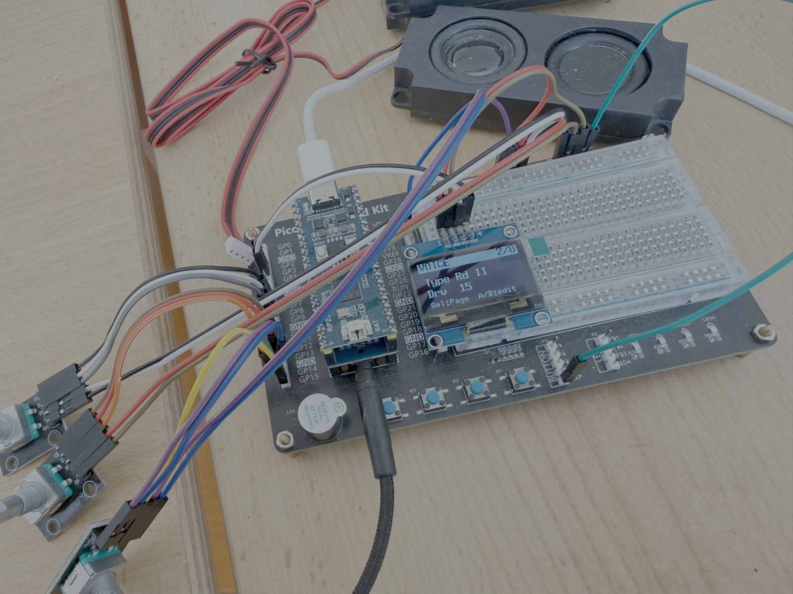

# PicoFaceCP

<p align="center">
  
</p>

**A Yamaha reface CP emulation**, one of the eight instruments in
[PicoVintageSynthCollection](../../README.md).

The [mda-EPiano](https://sourceforge.net/projects/mda-vst/) sound engine drives
six classic electric-piano voices, processed through a re-creation of the
**reface CP** insert-effect chain and controlled from the OLED and the three
rotary encoders. A macOS host build lets the whole signal path be auditioned on
the desktop before flashing.

---

## Features

- **6 voices** (mda-EPiano sample engine, 96-voice polyphony, 44.1 kHz, stereo):
  `Rd I` · `Rd II` · `Wr` · `Clv` · `Piano` · `CP`
- **reface CP effect chain** - four insert effects in series plus drive and
  volume, with authentic 3-position switching per block and voice-type-linked
  tremolo.
- **MIDI, reface CP compatible** - note on/off, pitch bend (±2 semitones), the
  full reface CP control change map (modulation, volume, expression,
  sustain/sostenuto/soft pedal, per-effect switches and depths, instrument
  select), channel mode messages, active sensing, and SysEx (identity reply,
  parameter change/request, bulk dump/request). Program change is *not*
  recognized, matching the original hardware. USB and DIN alike, both provided
  by the core. Full spec: [`doc/MIDI_IMPLEMENTATION.md`](doc/MIDI_IMPLEMENTATION.md).
- **Paged front-panel UI** - the selector encoder pages through eight parameter
  screens (VOL/OCT · VOICE · TREM/WAH · CHO/PHA · DLY · REVERB · V.PARAMS ·
  SYSTEM); param A and param B set the two on-screen values. A short selector
  press cycles the effect mode on the TREM/CHO/DLY screens; a long press opens
  the Presets / System menu.
- **Pre-gain** - an extra stage ahead of drive attenuates the signal feeding the
  FX chain, since some effects (drive, wah) tend to clip hot signals.
- **Header-only, RP2350-optimized DSP** - single-precision float throughout, no
  heap, the per-sample hot path placed in RAM to avoid XIP cache jitter.
- **Virtual EEPROM persistence** - knobs, instrument, octave and MIDI system
  settings survive power cycles, autosave 2 s after the last change; see
  [`doc/PERSISTENCE.md`](doc/PERSISTENCE.md).
- **macOS host demo** running the exact same effect code, see
  [`tools/host_tests/cp/`](../../tools/host_tests/cp/README.md).

Footprint in the collection build: 4,431,496 bytes of flash (the sample sets
dominate), 178,104 bytes of RAM.

---

## Signal flow

```
              ┌──────────┐   ┌────────┐   ┌──────────────┐   ┌───────────────┐   ┌─────────────────┐   ┌────────┐
MIDI ▶ Voice ▶│ PRE-GAIN │ ▶ │ DRIVE  │ ▶ │ TREMOLO / WAH│ ▶ │ CHORUS /PHASER│ ▶ │ D.DELAY/A.DELAY │ ▶ │ REVERB │ ▶ VOLUME ▶ I2S out
       engine └──────────┘   └────────┘   └──────────────┘   └───────────────┘   └─────────────────┘   └────────┘
```

| Block | Switch positions | Parameters |
|-------|------------------|------------|
| **Pre-gain** | - | level (PicoFaceCP only, no reface CC equivalent; avoids FX clipping) |
| **Drive** | - | amount |
| **1 · Tremolo / Wah** | Off / Tremolo / Wah | Depth, Rate |
| **2 · Chorus / Phaser** | Off / Chorus / Phaser | Depth, Speed |
| **3 · D.Delay / A.Delay** | Off / Digital / Analog | Depth, Time |
| **4 · Reverb** | - | Depth |
| **Volume** | - | output level |

The **tremolo** automatically follows the selected voice, exactly like the
hardware: auto-pan for `Rd I` / `Rd II` / `CP`, amplitude modulation for
`Wr` / `Clv` / `Piano`. The reference for these effects is Yamaha's official
reface owner's manual, "reface CP" section - not shipped with this repository.

---

## Hardware

The board is the same for every instrument in the collection; the pin map lives
in [core/include/project_config.h](../../core/include/project_config.h).

The image is **4.22 MB** — the six sample sets are most of it — so this one does
not fit a 4 MB board such as a base Pico 2, and there is no reduced variant. An
oversized `.uf2` stops copying without saying why. See
[How much flash an instrument needs](../../README.md#how-much-flash-an-instrument-needs).

---

## Layout

```
instruments/PicoFaceCP/
├── effects/                 reface CP effect chain (header-only)
│   ├── dsp_fastmath.h         fast tanh/tan approximations
│   ├── dsp_lut.h              sine lookup table
│   ├── dsp_reverb.h           Schroeder stereo reverb
│   ├── reface_cp_fx.h         tremolo / chorus / phaser / delay primitives
│   ├── wahwah.h               standalone MK8 touch wah
│   ├── reface_cp_chain.h      RefaceCpChain master class
│   ├── cp_hot.h               CP_HOT() RAM placement macro
│   └── cp_audio.h             int16 <-> float block glue
├── include/                 engine, UI and settings headers
│   ├── mdaEPiano*.h           engine plus the six sample sets
│   ├── CP_Ui.h                front panel and menu as a state machine
│   ├── ipc.h                  same-core ring between control side and producer
│   ├── midi_reface.h          reface CP MIDI protocol layer
│   └── settings.h             persisted snapshot
├── src/                     CP_Instrument.cpp (the adapter), CP_Ui.cpp,
│                            mdaEPiano.cpp, midi_reface.cpp, presets.cpp,
│                            settings.cpp
├── doc/                     MIDI implementation, persistence, presets, changelogs
└── instrument.cmake
```

---

## Building

Built together with the rest of the collection, or on its own:

```bash
cmake -S . -B build -G Ninja -DCMAKE_BUILD_TYPE=Release -DPICOFACE_INSTRUMENTS_FILTER=PicoFaceCP
cmake --build build
```

Flash `build/PicoFaceCP.uf2` by holding BOOTSEL while plugging in the board and
copying the file to the `RPI-RP2` drive, or with
`picotool load build/PicoFaceCP.uf2`.

---

## Controls

The front panel uses **three rotary encoders**: the **selector** moves between
screens and navigates menus, while **param A** and **param B** edit the two
values shown on the current screen. Each value screen looks like this:

```
 TREM: Tremolo   3/7   <- header: title (+ current mode) and page number
 ------------
 Depth 25
 Rate  60
 Sel:Mode  A/B:edit    <- hint line
```

- **Turn the selector** to step through the 8 screens:
  1. **VOL / OCT** - master volume (A) and octave -2..+2 (B). The octave is a
     note transpose applied before synthesis.
  2. **VOICE** - voice type (A) and drive (B).
  3. **TREM / WAH** - depth (A) and rate (B).
  4. **CHO / PHA** - depth (A) and speed (B).
  5. **DLY** - depth (A) and time (B).
  6. **REVERB** - reverb depth (A).
  7. **V.PARAMS** - scroll the mda-EPiano parameter list with A, edit the
     selected value with B.
  8. **SYSTEM** - MIDI receive channel (A, 1-16 or *All*) and pre-gain (B,
     0-100 %, applied ahead of the FX chain).
- **Short press the selector** on the TREM / CHO / DLY screens to cycle that
  effect's mode (Off -> A -> B): Off->Tremolo->Wah, Off->Chorus->Phaser,
  Off->Digital->Analog. The header shows the active mode.
- **Long press the selector** opens the main menu: `Presets` · `System` ·
  `<< BACK`.
- **Param A / param B** set the two on-screen values live; pressing their switch
  resets that value to a default.

> Note: changing the octave while keys are held can leave a note hanging - the
> note-off is transposed by the *current* octave. Release keys before switching
> octaves.

---

## Design notes (RP2350)

- **Header-only DSP, no dynamic allocation** - everything lives in fixed buffers
  and compiles for both the Cortex-M33 firmware and the host build.
- **Hot path in RAM** - `cp_hot.h` maps `CP_HOT()` to the SDK's
  `__not_in_flash_func`, so the per-sample chain (`RefaceCpChain::process`, which
  the compiler inlines whole) runs from SRAM and avoids flash XIP cache stalls;
  on the host the macro is a no-op.
- **int16 delay line** - the 500 ms stereo delay stores `int16` samples, which is
  lossless relative to the 16-bit engine source and roughly halves its RAM use.
- **Single-precision float** throughout the audio path (the M33 has a hardware FP
  unit; `double` is avoided) - this includes mdaEPiano's note on/off envelope and
  pitch math (`exp`/`pow`/`sqrt` -> `expf`/`powf`/`sqrtf`).
- **Virtual EEPROM** in the last 8 KB of flash, a wear-levelled 256-byte CRC
  record log. The write runs on core0 between two audio blocks. In the
  standalone version of this project the UI owned core1 and core0 had to be
  parked in a RAM spin loop for the duration; that handshake disappeared with the
  move to the collection's standard runtime model, see
  [docs/ARCHITECTURE.md](../../docs/ARCHITECTURE.md), section 4a.

---

## Acknowledgements and license

- Sound engine: **mda-EPiano** © Paul Kellett / David Robillard, GPL.
- reface CP behaviour modelled from Yamaha's official owner's manual.
- DSP and UI code for the effect chain were developed with an LLM-assisted
  workflow (architecture and review by the maintainer, code generation via
  glm-5.2).

GNU General Public License v3, inherited from mda-EPiano. See
[the licensing section of the root README](../../README.md#license).
