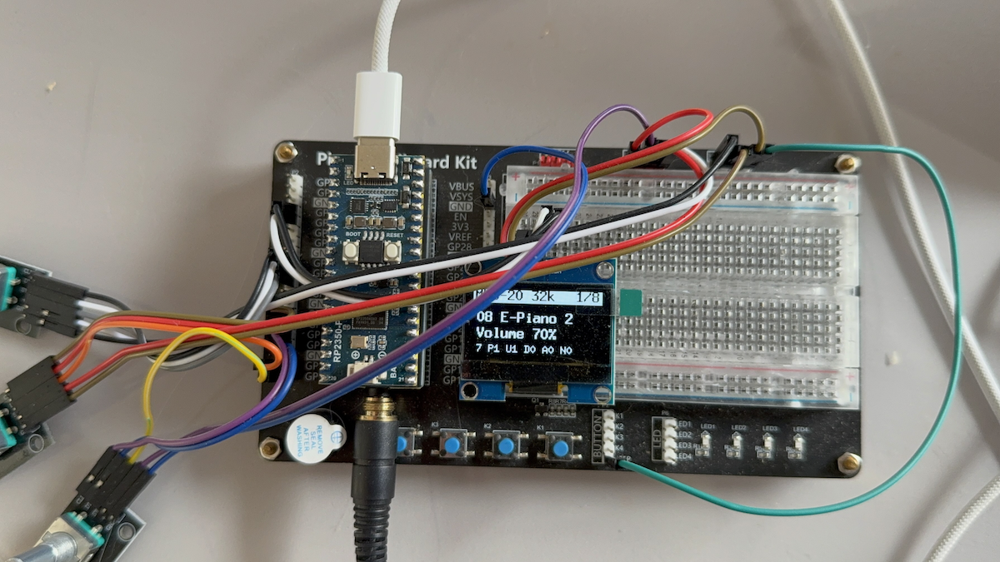

# PicoFaceRD

<p align="center">
  
</p>

A Roland **MKS-20 / MK-80** ("S/A synthesis") digital piano clone, one of the
ten instruments in [PicoVintageSynthCollection](../../README.md). Instead of emulating the original hardware cycle-exactly at runtime, it plays a **descriptor-driven re-implementation** of the S/A engine: the original firmware's voice programming was captured note-by-note on a host-side reference emulator, distilled into compact per-note descriptors, and is replayed on-device with chip-exact envelope arithmetic. The result is validated against the reference emulator with a cross-correlation matrix of 1920 cells (median r = 0.9997).

Like PicoFaceJV and PicoFaceD5 this instrument **needs a local ROM set** and is
therefore not in the release binaries. Without one the configure step skips it
with a note and everybody else's build stays green.

## What it needs

Everything goes in `roms/` beside the instrument (gitignored). Nothing in it is
distributable, and nothing derived from it is in this repository either.

| File | Size | What it is |
|---|---|---|
| `mks20_15179736.BIN`, `mks20_15179737.BIN`, `mks20_15179738.BIN` | 128 KB each | MKS-20 sample chips, first set |
| `mks20_15179739.BIN`, `mks20_15179740.BIN`, `mks20_15179741.BIN` | 128 KB each | MKS-20 sample chips, second set |
| `MK80_IC5.bin`, `MK80_IC6.bin`, `MK80_IC7.bin` | 128 KB each | MK-80 sample chips |
| `pack_p0.rdp` … `pack_p15.rdp` | ~3.3 MB total | the note descriptors, one file per patch |

A **single-machine build needs only that machine's half** of the table above --
see [Fitting a 4 MB Pico 2](#fitting-a-4-mb-pico-2):

| `PICOFACERD_MODEL` | sample chips | packs |
|---|---|---|
| `BOTH` (default) | all nine | `pack_p0` … `pack_p15` |
| `MKS20` | the six `mks20_1517973*.BIN` | `pack_p0` … `pack_p7` |
| `MK80` | `MK80_IC5/IC6/IC7.bin` | `pack_p8` … `pack_p15` |

Three more are needed to *make* the packs, though not to build once they exist:

| File | Size | What it is |
|---|---|---|
| `mks20_15179757.BIN` | 128 KB | MKS-20 parameter ROM |
| `MK80_IC18.bin` | 128 KB | MK-80 parameter ROM |
| `RD200_B.bin` | 8 KB | sound-CPU firmware |

All names are as the preserved dumps carry them. **`RD200_B.bin` and not one of
the MKS-20's own** — the parser follows that firmware's arithmetic, and looks
for its velocity curves at `$ed9d`, where the MKS-20's ROMs keep theirs
somewhere else. It makes no audible difference which is used: the two sets of
curves differ by at most 2 in 252, and building patch 0 both ways gives 25,539
segments and not one different. But the parser has one address compiled in, and
it is that one.

### Fitting a 4 MB Pico 2

PicoFaceRD carries both machines in 2.56 MB, which fits a 4 MB board on its
own -- so this is a choice about how many patches to ship, not a way to make it
fit. Either machine alone is smaller again, because the two halves barely share
anything: the MKS-20's eight patches read two sample banks, the MK-80's eight
read the third. A single-machine build also needs only that machine's ROMs,
which is the reason to reach for it.

```bash
cmake -S . -B build -G Ninja -DCMAKE_BUILD_TYPE=Release \
      -DPICOFACE_INSTRUMENTS_FILTER=PicoFaceRD -DPICOFACERD_MODEL=MK80
```

| `PICOFACERD_MODEL` | patches | image | board |
|---|---|---|---|
| `BOTH` (default) | 16 | 2.56 MB | fits 4 MB |
| `MKS20` | 8 | 1.73 MB | fits 4 MB |
| `MK80` | 8 | 1.23 MB | fits 4 MB |

A single-machine build also only needs that machine's ROMs -- three sample
chips and eight packs -- so half a ROM set is enough to build one.

The eight patches renumber from 1, which is how the machine itself numbers
them; the header shows which machine it is. Program Change folds onto whatever
the build ships. **Nothing else changes**: the patches are the same data played
the same way, and
[`tools/rd_extract/check_variants.sh`](../../tools/rd_extract/check_variants.sh)
is what says so -- it renders every patch of every variant through the bridge
and requires MK-80 patch 0 to be the full build's patch 8 to the sample, at the
same rate and under the same name.

### What the build does with the ROMs

The sample ROMs become a blob at configure time -- one packed bank each plus the
chip's two arithmetic tables, which is all the engine reads. 1.81 MB for the
full build, 1.31 MB for `MKS20`, 0.81 MB for `MK80`.

```bash
cmake -S . -B build -G Ninja -DCMAKE_BUILD_TYPE=Release \
      -DPICOFACE_INSTRUMENTS_FILTER=PicoFaceRD
cmake --build build
```

Nothing but Python and the ROMs. The descrambling is
[`tools/rd_extract/rd_descramble.py`](../../tools/rd_extract/rd_descramble.py),
a table of the address and data lines the boards cross over; the chip's two
lookup tables sit beside it as 27 KB of compressed data, because they are
constants the chip computes from its own arithmetic rather than anything read
from a ROM.

### Where the packs come from

They are the one input here that cannot be downloaded from anywhere. There are
two ways to make them, and the first is the one that made the packs this
instrument ships with.

**Computed, from the ROMs.** The firmware's own arithmetic, rewritten from the
disassembly in [`tools/rd_extract/RD_FIRMWARE.md`](../../tools/rd_extract/RD_FIRMWARE.md).
Minutes, and no emulator runs:

```bash
R=instruments/PicoFaceRD/roms
python3 tools/rd_extract/rd_descramble.py $R \
    RD200_B.bin mks20_15179757.BIN /tmp/prog.bin /tmp/mks.bin
python3 tools/rd_extract/rd_descramble.py $R \
    RD200_B.bin MK80_IC18.bin /tmp/x.bin /tmp/mk80.bin
python3 tools/rd_extract/rd_make_packs.py /tmp/prog.bin /tmp/mks.bin $R \
    0 0x000000 1 0x008000 2 0x010000 3 0x018000 \
    4 0x003c20 5 0x00ab50 6 0x014260 7 0x01bef0
python3 tools/rd_extract/rd_make_packs.py /tmp/prog.bin /tmp/mk80.bin $R \
    8 0x000020 9 0x008000 10 0x010000 11 0x018000 \
    12 0x002c00 13 0x00b1f0 14 0x012910 15 0x0199f0
```

Those sixteen offsets are the patch tables, read out of the ROMs themselves --
the MKS-20 keeps its in its sound-CPU ROM at `$e82b`, the MK-80 at the head of
its parameter ROM. `RD_FIRMWARE.md` says how.

**Captured, by playing every note.** The older way, and how the packs were first
made. Hours rather than minutes, and it is the only path that needs the
emulator -- two checkouts of it, in fact:

```bash
git clone https://github.com/Michi71/rdpiano ~/rdpiano
git clone https://github.com/Michi71/librdpiano ~/librdpiano
RDPIANO=~/rdpiano RDPIANO_REF=~/librdpiano \
    tools/rd_extract/make_packs.sh instruments/PicoFaceRD/roms \
                                   instruments/PicoFaceRD/roms
```

For each patch the reference emulator plays **all 88 keys at four velocities**
(40, 80, 110, 127) while a hook records every register write the original
firmware makes to the sound chip; the analyzer distils those into per-note
descriptors and the packer writes the binary. 352 entries a patch, sixteen
patches. It takes a while — about six seconds of emulated audio per note, 5632
notes in all — so name patches on the command line to do a few at a time.

Two checkouts again, and for the same reason as the regression harness:
`RDPIANO` is the upstream emulator, whose firmware execution is what the
capture watches; `RDPIANO_REF` is the adapted one the capture drives through
`loadPatch`. Only this second path needs either -- the computed one above, and
the firmware build, need neither.

**The reference has to be current.** The emulator that produced the packs this
instrument was measured against had cached part state
(`phase_inc_cached`, `pitch_hi2`, `wave_loop_inv`) that the published fork does
not yet carry. Capturing without it builds and runs and silently yields
different packs — patch 0 comes out 236,684 bytes instead of 215,294 — and an
instrument that sounds different from the one every number in this README refers
to. `make_packs.sh` checks for it and says so.

They are derived from Roland's ROMs and are no more distributable than the ROMs
are, which is why they sit in `roms/` rather than in the tree.

## Features

| Area | Details |
|---|---|
| Sounds | All 16 patches: MKS-20 (Piano 1–3, Harpsichord, Clavi, Vibraphone, E-Piano 1–2) and MK-80 (Classic, Special, Blend, Contemporary, A. Piano 1–2, Clavi, Vibraphone). A 4 MB build ships one machine's eight — see [Fitting a 4 MB Pico 2](#fitting-a-4-mb-pico-2) |
| Engine | Timeline-replay of captured S/A voice programming; 10 parts per voice, chip-exact envelope math, native 20 kHz / 32 kHz per patch (no resampling) |
| Polyphony | 8 / 16 / 24 / 32 voices or **Auto** — a load-adaptive voice governor with active culling (default; the original is 16-voice) |
| Effects | In the machines' own order: vintage DAC stage (16-bit requantization + 2-pole reconstruction filter), bass/treble shelves, stereo BBD-style chorus, 4-stage phaser per channel, antiphase stereo tremolo |
| MIDI | USB and DIN MIDI, implementation modeled on the MK-80 MIDI implementation chart (sounding range 21–108 with octave folding, damper, FX switches CC 92/93/95, reset CC 121, all-notes-off CC 123, program change, pitch bend ±2 semitones) — see [doc/MIDI.md](doc/MIDI.md) and the collection's CC table in [docs/ARCHITECTURE.md](../../docs/ARCHITECTURE.md), section 6a |
| Tuning | Master tune ±50 cents in 1-cent steps with live A4 frequency display |
| Persistence | All panel settings in a wear-leveled flash append log (versioned, CRC-protected), auto-saved 2 s after the last edit while idle |
| Display | Boot splash, header-bar page UI with percent values (1 % encoder steps) and a live diagnostics footer |
| Clocking | Dual Cortex-M33 @ 480 MHz, flash at 120 MHz QSPI (in spec), dual-core voice rendering |

## Hardware

The board is the same for every instrument in the collection; the full pin map
lives in [core/include/project_config.h](../../core/include/project_config.h),
and [doc/hardware/PROTOTYPE.md](doc/hardware/PROTOTYPE.md) describes a complete
3U/10HP module build (panel, stripboards, wiring).

This instrument is the one that pushes the platform hardest: it runs at 480 MHz
with flash at 120 MHz QSPI, set through `PICOFACE_SYS_CLOCK_HZ` and
`PICOFACE_QMI_M0_TIMING_TARGET` in its `instrument.cmake`. The other eight run
at 444 MHz.

Note: the build uses the SDK board definition `sparkfun_promicro_rp2350` as a
compatible 16 MB stand-in — the Waveshare RP2350 Plus has no board file in the
pinned SDK, and all pins used here are addressed explicitly, so the only thing
taken from the board file is the 16 MB flash size (which matches).

The image is **2.56 MB** and fits a 4 MB board such as a base Pico 2. It was
5.15 MB until the packs stopped storing four velocity layers of every note and
started storing the parameter ROM's corners instead. An oversized `.uf2` stops
copying without saying why. See
[How much flash an instrument needs](../../README.md#how-much-flash-an-instrument-needs).

## User interface

Encoder **Select** switches the page (with wrap-around), encoders **A** and **B** edit the two page parameters. Continuous values are shown in percent and step 1 % per detent.

| Page | Encoder A | Encoder B |
|---|---|---|
| PATCH | Instrument 1–16 (header shows the bank: `MKS-20` / `MK-80`) | Volume |
| CHORUS | Depth (0 % = off) | Rate, shown in Hz (0.37–5.71) |
| TREMOLO | **Pan** (0 % = off) — it moves the image, it does not dip the level | Rate, shown in Hz (0.48–7.70) |
| PHASER | Depth (0 % = off) | Rate, shown in Hz (0.10–5.00) |
| EQ | Bass (50 % = neutral) | Treble (50 % = neutral) |
| VOICES | Polyphony 8/16/24/32/**Auto** | — (line B shows live `Act <active>/<limit>`) |
| TUNE | Master tune ±50 cents | — (line B shows the resulting A4 frequency) |
| SYS | Vintage DAC filter ON/OFF | MIDI receive channel 1–16 / Omni |

The chorus and tremolo rates are shown in Hz because the figures mean something:
both service manuals tabulate the LFO period for all fifteen settings, and the
laws live in one place (`rd_params.h`) so the display cannot drift away from the
thing it is describing. Verified against the engine: 0.9 % at the slowest
setting, 0.2 % elsewhere.

The footer shows a live diagnostics line: `<instrument> P<peak-load %> U<buffer underruns> D<dropped events> A<active voices> N<note-on count>`.

### Voice governor (Auto mode)

In **Auto**, the polyphony limit follows the CPU load: the base limit is the machine's own per-rate cap (16 voices for 20 kHz patches, 10 for 32 kHz -- both service manuals give polyphony per voice, and the split lands exactly on the sample rate, sixteen sounds for sixteen; 16 x 20000 = 10 x 32000 = 320000 voice slots per second, which is the S/A chip's fixed budget). When the instantaneous render load reaches 90 % — or a buffer underrun is detected — the governor cuts the limit (down to a floor of 6), and excess voices are faded out within a single 64-sample block (~3 ms, click-free) instead of waiting for their natural decay. Recovery is deliberately slow (+1 voice per 700 ms, only below 70 % load) to avoid pumping. Manual settings bypass the governor entirely.

## Building

Built together with the rest of the collection, or on its own:

```bash
cmake -S . -B build -G Ninja -DCMAKE_BUILD_TYPE=Release \
      -DPICOFACE_INSTRUMENTS_FILTER=PicoFaceRD
cmake --build build
```

If you already have a shared SDK checkout, export `PICO_SDK_PATH` (and
optionally `PICO_EXTRAS_PATH`) instead of initialising the `lib/pico-sdk` and
`lib/pico-extras` submodules — the in-tree submodules are only the fallback.
The `lib/u8g2/u8g2` submodule is always required.

Flash `build/PicoFaceRD.uf2` via BOOTSEL. Footprint in the collection build:
5,305,676 bytes of flash (the sample banks dominate), 48,024 bytes of static RAM
plus about 44 KB of heap for the pack descriptors.

## Architecture

```
                         Core 0                                Core 1
  ┌───────────────────────────────────────────────┐   ┌─────────────────────────┐
  │ main loop: USB-MIDI · encoders · OLED (staged │   │ RAM-resident render     │
  │ half-tile flush) · settings autosave          │   │ worker: odd-index       │
  │        │  same-core SPSC event ring           │   │ voices, one doorbell    │
  │        ▼                                      │   │ rendezvous per 64-      │
  │ audio producer: drains ring → RdNewEngine     │◄──┤ sample block            │
  │ block render (even voices) → vintage FX →     │   └─────────────────────────┘
  │ softclip → I2S buffer pool → PIO I2S DMA      │
  └───────────────────────────────────────────────┘
```

The sound data pipeline is host-side: the sound CPU's own arithmetic, read out of its firmware in [`RD_FIRMWARE.md`](../../tools/rd_extract/RD_FIRMWARE.md) and rewritten in Python, walks each (patch, note) through the parameter ROM to per-note part descriptors (pitch, wave region, the envelope list's corner bytes, the velocity map and curves); a packer emits compact `.rdp` packs that are embedded in the firmware together with losslessly repacked 4-byte sample banks. On-device, `RdNewEngine` replays those descriptors with the same envelope arithmetic as the chip.

Details in [doc/ARCHITECTURE.md](doc/ARCHITECTURE.md). The full engineering log
with the complete debugging history lives in [doc/RD_PORT.md](doc/RD_PORT.md).

RD is the only instrument that uses core1: it keeps a RAM-resident render worker
there and switches the sample rate at runtime. Both go through optional hooks of
the instrument interface, see [docs/ARCHITECTURE.md](../../docs/ARCHITECTURE.md),
section 8.

## Development & testing

Everything is verified host-first on the Mac/Linux side before it touches the device:

```sh
RDPIANO=~/rdpiano tools/rd_extract/run_regression.sh
```

builds the sample banks and the packs from `roms/` exactly as the firmware
build does — so the test covers exactly what ships — then builds two host
tools, runs a six-cell A/B matrix against the reference emulator with frozen
expected correlations, and runs stuck-voice stress tests (chord hammering with
sustain pedal, single- and dual-thread). `REGRESSION PASS/FAIL` with an exit
code.

`RDPIANO` is [giulioz/rdpiano](https://github.com/giulioz/rdpiano) in its
**original state** -- the A/B test measures against that and refuses an adapted
copy, because an adaptation can carry per-patch tone shaping the original does
not have, and then the test measures the adaptation. The capture path is the
one that wants `RDPIANO_REF`, the adapted one with the model tables
compiled in, which is what the A/B test compares against. The extraction and
analysis toolchain is documented in
[tools/rd_extract/README.md](../../tools/rd_extract/README.md).

### Output headroom, and the one thing the A/B test cannot see

The A/B matrix measures correlation against the reference emulator, and
correlation is scale-invariant. It has been fooled by this before -- a 16 dB
level error once passed it untouched -- so anything about *level* has to be
measured separately. This is the second such finding.

The bridge scales the engine accumulator by 1/131072, runs the vintage FX, and
ends on a rational softclip with its knee at 0.9. Measured across 720 cases
(all sixteen instruments x 1..16 notes x velocity 60..127, at the shipped
volume default of 80 %), that put **17.2 % of them into the softclip**, with
the 99th percentile at 12.6 % distortion and the worst case at 20 %.

Those are piano chords. Ten notes under the pedal is ordinary playing, not an
edge case. And the mechanism is specifically a *transient* one -- the peak loss
tracks the overdrive almost exactly:

| past the knee | distortion | peak loss |
|---|---|---|
| +0.9 dB | 0.24 % | 0.45 dB |
| +2.9 dB | 2.34 % | 2.19 dB |
| +4.9 dB | 5.73 % | 4.11 dB |
| +6.9 dB | 10.36 % | 6.07 dB |

So the attack of a note was being flattened by up to 6 dB while the body of it
stayed where it was. That is what "harder than the original" sounds like, and
it is not something a reconstruction filter can fix: the same measurement run
showed the RD's own output carries only 2.7 % of its attack energy above 4 kHz
and nothing at all above 8 kHz, and the vintage DAC stage (on by default,
-2.8 dB at 4 kHz, -7.2 dB at 8 kHz net) already moves the whole signal by
0.3 dB RMS. There was never any brightness up there to take away.

A trim of 0.5 sits after the FX stage -- after, because the 12-bit
requantization and the phaser's tanh feedback are nonlinear and trimming ahead
of them would move their operating point and coarsen the quantizer by a bit
relative to the music. Re-measured on the changed code:

| | in the softclip | 99th pct distortion | worst | loudest raw peak |
|---|---|---|---|---|
| before | 17.2 % | 12.55 % | 20.21 % | +9.33 dB |
| after | **2.1 %** | **0.83 %** | **4.63 %** | +3.38 dB |

It costs 6 dB of output, which the volume control and the amplifier take back.
What it buys is the top of the dynamic range: from the 75th percentile to the
loudest case there used to be 2.5 dB of room (-2.54 to -0.04 dBFS) because
everything above was pinned against the ceiling. Now there is 8.4 dB
(-8.56 to -0.13 dBFS), and the headroom is still being used.

[tools/rd_midi/](../../tools/rd_midi/) holds MIDI utilities for testing: `midi_keyboard_only.py` strips a Standard MIDI File down to pure keyboard performance (notes, damper, pitch bend) so sequencer dumps can be replayed against the device.

### What the service notes settled

The MKS-20 Service Notes (Roland, June 1986) turned up after the effect chain
was already written from the block diagram and the ear. Three things came out
of the CPU-B board schematic and the adjustment tables.

**The reconstruction filter was right.** The DAC output runs through FL1
(`0538-014`, a Roland custom low-pass module whose internals the schematic does
not show) and then an inverting stage on IC1 (µPC4570) whose feedback is
R14 33k in parallel with C7 1200 pF -- a pole at **4019 Hz**. Against the
measured response of the vintage DAC stage in `rd_effects.cpp`:

| | 2 kHz | 4 kHz | 6 kHz | 8 kHz | 12 kHz |
|---|---|---|---|---|---|
| this engine | −0.8 | −2.8 | −5.1 | −7.2 | −10.1 dB |
| pole at 4019 Hz | −0.96 | −2.99 | −5.09 | −6.96 | −9.96 dB |

Within 0.24 dB across the band. A stage that was guessed turns out to match the
hardware; the guess stands, now with a source behind it.

(The schematic also shows *two* channels with different poles -- the second is
R11 33k with C6 820 pF, 5882 Hz -- fed from one time-multiplexed PCM54 through
HI-201 analogue switches and summed by IC2 at a gain of 1.5. Whether those two
correspond to the 20 kHz and 32 kHz voice groups is a guess the schematic does
not support.)

**The DAC is 16 bit, not 12.** The parts list names IC4 as a `PCM 54`, "16 bit
D/A converter". The stage here requantized to 12 bits, and did it with a cast,
which truncates toward zero and so leaves a dead band one LSB wide either side
of silence. Measured on a 441 Hz tone, THD+N improved by 14.2 dB at −20 dBFS,
27.3 dB at −40 dBFS and 33.1 dB at −60 dBFS. Worse than the numbers: the 12-bit
step over ±1.0 is −66.2 dBFS, so with truncation **everything below about
−66 dBFS came out as digital silence**. A piano tail did not fade, it stopped.

**The chorus LFO was nearly five times too slow at the top.** The adjustment
section tabulates the LFO period at CP3 for all fifteen settings, 2700 ms down
to 175 ms. That is 0.370 to 5.714 Hz, linear in the setting to within 3.7 %.
The code had 0.3 to 1.2 Hz. Tremolo, tabulated the same way at CP4, was already
right (0.476 to 7.69 Hz against 0.5 to 8.0).

**The chorus keeps its detune, not its sweep.** The CP3 table gives the LFO
amplitude as well as the period, and their ratio is constant at 3.98 mV/ms
(±9 % across all fifteen settings) -- a triangle of constant slope, so the
amplitude is proportional to the period. What that buys is not width for its
own sake: a constant slope on the BBD clock control is a constant rate of
change of delay, which is a constant pitch deviation. The original holds its
detune and only changes how fast it wobbles.

The model here held the delay swing constant instead, so the detune grew with
the rate. Measured at full depth on the wet path, peak deviation of a 1 kHz
tone:

| setting | LFO | before | after |
|---|---|---|---|
| 0.00 | 0.370 Hz | ±16 ct | ±27 ct |
| 0.25 | 1.706 Hz | ±76 ct | ±126 ct |
| 0.50 | 3.042 Hz | ±135 ct | ±135 ct |
| 0.75 | 4.378 Hz | ±195 ct | ±135 ct |
| 1.00 | 5.714 Hz | ±255 ct | ±135 ct |

Flat across the fast half to 0.3 ct, against a fifteen-fold spread before.
Below about 1.8 Hz at full depth it flattens off, because the swing is clamped
to the centre delay -- that is physics, not a guard: a BBD's delay is
stages / (2 × clock) and cannot go negative, and a swing equal to the centre is
already a 2:1 clock sweep. Without the clamp the read index wraps to the far
end of the line and the output is garbage.

The absolute width is not derivable from the notes -- the table gives volts at
the LFO, and the volts-to-delay law lives in the MN3101 clock oscillator, which
the schematic does not break out.

**A period-correct bound, from a different Roland schematic.** A review of the
MKS-20 describes its chorus as sounding like "a fat CE-1", and the Boss CE-1
(ET-10D) service schematic is available -- and annotated. Test point G sits on
the line from the Q3-Q6 multivibrator to pin 2 of IC-2, which is the BBD clock,
and it is marked **5 µs to 16 µs**. A BBD delays by stages / (2 x clock), so
with the CE-1's MN3002 at 512 stages that is 1.28 to 4.10 ms; the MKS-20's
MN3007 has twice the stages, so the same clock range gives it **2.56 to
8.19 ms**.

Two things follow, neither of which the MKS-20's own notes could give:

- The 5 ms centre delay used here sits inside that window and close to its
  middle (5.38 ms). It had been simply chosen.
- The sweep before this change was ±3 ms, which is 6 ms peak to peak -- **106 %
  of the entire VCO span**, wider than the part can travel at all, and that span
  covers the CE-1's deeper vibrato mode as well as its chorus. ±0.7 ms is 25 %
  of it, which is where a chorus rather than a vibrato belongs.

Stated as a dependency: the schematic names the ICs but not their stage counts,
so 512 for the MN3002 and 1024 for the MN3007 come from the parts rather than
from the drawing. Were the MN3002 a 1024-stage device the windows would double
and the "wider than the part can travel" reading would soften to about half. So the anchor is a judgement, and it has been
made twice. It first preserved whatever depth this engine already had, which
measured 132 cents of peak detune at full depth and 67 at the shipped default
of 50 %. Two thirds of a semitone is not a chorus, and hardware testing said so.
It is now 31 cents at full depth and 16 at the default, which puts the whole
range inside the 10-to-30 a BBD chorus of the period sits in, with the default
in the middle of it. Set by ear against what the part can plausibly do.

### What the MK-80 notes added

The MK-80 Service Notes (Roland, September 1989) arrived after the MKS-20 ones
and mostly agreed with them -- which is itself worth having, because two of the
agreements are checks that could not be run before.

**The sample rates are right, confirmed twice.** Both manuals give polyphony
per voice, 16 or 10. That split lands exactly on the rate table: every
16-voice sound in either list is one of the 20 kHz patches, every 10-voice
sound one of the 32 kHz ones, sixteen for sixteen. The rates came out of ROM;
two service manuals agree with them independently. (The cap itself was wrong
and is fixed separately -- 16 x 20000 = 10 x 32000 = 320000 voice slots per
second, the S/A chip's fixed budget.)

**The MK-80 uses the same converter and the same filter.** `PCM 54` and
`LC Filter LPF 0538-014`, part number 12449269 in both parts lists. Giving both
machines one reconstruction stage is correct rather than merely convenient.

**The effect chain runs the other way round.** Both block diagrams are
`EQ -> chorus -> phaser -> tremolo/VCA -> out` (MKS-20 p.4, MK-80 p.17; the
MKS-20 has no phaser, so its chain is chorus -> tremolo). This engine ran
`tremolo -> phaser -> chorus`, so the tremolo went *through* the delay line --
smeared over five milliseconds and split unevenly across the two taps, where
the original applies it last and cleanly.

**And the tremolo is a pan, not a level wobble.** The MK-80 notes adjust the
two VCAs separately (VR8 for OUTPUT-L, VR9 for OUTPUT-R) and the scope trace
for that step shows the channels exactly interleaved: the right swells where
the left is at its trough, each returning to the baseline. Measured before and
after, envelope of a 1 kHz tone at full depth:

| | L/R correlation | swing per channel | swing of the sum |
|---|---|---|---|
| before | **+1.000** | −14.0 dB | −14.0 dB |
| after | **−1.000** | −69.8 dB | **−0.0 dB** |

So it used to pump the whole signal by 14 dB and now moves it across the image
at constant loudness. The trough reaching silence is from the same page: the
instruction is to set it "at minimum level (possibly zero swing)", where the
factor here stopped at 0.2 of full scale.

The phaser is per channel now, as it is on the board (IC33 twice, each inside
its own NE572 compander) -- after the chorus the two sides are no longer the
same signal, so one mono phaser has nothing coherent to work on. Cost of the
whole reordering, measured on the host: +5 % through the chain with the phaser
off, +9 % with it on. The host understates it, as it always does for this kind
of change, but the chain is a fraction of a percent of the render either way.

One thing the MK-80 has that the MKS-20 does not, noted and not acted on: an
`IR3109` VCF, and the phaser itself. Strictly the phaser should not be offered
on MKS-20 patches at all. It is off by default and switchable, so this is
cosmetic.

## ROM data & credits

- **[giulioz/rdpiano](https://github.com/giulioz/rdpiano)** — the reverse
  engineering of the Roland S/A sound generation, MCU emulation and ROM
  descrambling that all of this rests on, by **Giulio Zausa**, itself building
  on **MAME**. The reference emulator is his work, it is host-side only, and it
  is **not in this repository**: the build and the regression harness are
  pointed at a checkout of it. Without it there is no way to turn a ROM set
  into anything this instrument can play.
- The sample banks and the note descriptors are *derived data* from MKS-20 /
  MK-80 ROM images and live in `roms/` with the ROMs, outside the repository.
  Roland is not affiliated with this project; all trademarks belong to their
  owners. This is a non-commercial educational/preservation project.
- **[u8g2](https://github.com/olikraus/u8g2)** (display), **Raspberry Pi Pico SDK / pico-extras** (platform, PIO I2S audio).
- Sibling instruments in this collection: [PicoFaceCP](../PicoFaceCP/README.md) is where the UI style, the phaser and the veeprom module come from.

## License

GPL-3.0. See [the licensing section of the root README](../../README.md#license).
