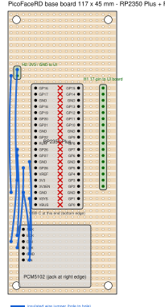
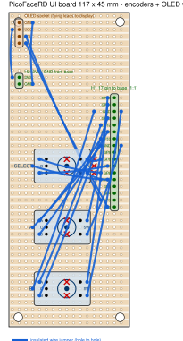

# PicoFaceRD — Prototype Build (3U / 10HP acrylic module)

Eurorack-style standalone module: acrylic front panel in 3U × 10HP
(128.5 × 50.8 mm), two stripboards stacked behind it.

```
front panel (acrylic, 3 mm)          ← encoders bolted through (M7 nuts),
   │  ~9 mm (EC11 body)                OLED on M3 standoffs behind window
UI stripboard                        ← encoder pins + OLED wiring, 1 header
   │  ~14 mm (M3 standoffs)            down to the base board
base stripboard                      ← RP2350 Plus on female headers + DAC
   │  ~6 mm
acrylic back plate (optional)        ← USB-C access from the side/bottom
```

Total depth ≈ 35–40 mm. The four M3 standoffs run through both boards and
take spacers to the panel; the encoders' panel nuts carry the turning
forces, so the UI board is mechanically relaxed.

## Parts (as purchased)

| Part | Type | Notes |
|---|---|---|
| Waveshare RP2350 Plus | Pico form factor, USB-C, 16 MB flash | 2 × 20 pins, 51 × 21 mm |
| PCM5102 DAC module ("GY-PCM5102") | I2S stereo DAC, 3.5 mm jack on board | solder-bridge config, see below |
| SH1106 OLED 1.3" I2C | 128 × 64, 4-pin (GND VCC SCL SDA) | PCB ≈ 35.5 × 33.5 mm — **measure yours** |
| 3 × EC11 rotary encoder | threaded bushing, switch, knob | 7 mm panel hole, nut mount |
| Stripboard set | 2.54 mm pitch | cut two boards, see sizes below |

## Wiring (netlist)

Identical to the breadboard — this is the authoritative table
(from [project_config.h](../../../../core/include/project_config.h), shared by every instrument in the collection).

### PCM5102 DAC

| DAC pin | Connect to | Remark |
|---|---|---|
| VIN | VSYS (5 V from USB) | module has its own 3.3 V LDO |
| GND | GND | |
| SCK | **GND** | forces the internal PLL — without this: silence |
| BCK | GP27 | I2S bit clock |
| DIN | GP26 | I2S data |
| LCK | GP28 | I2S word clock |

Solder bridges on the module back (the usual "no sound" trap; your
breadboard module is already configured — keep it as it is):
`1(FLT)=L  2(DEMP)=L  3(XSMT)=H  4(FMT)=L`.

### SH1106 OLED (I2C)

| OLED pin | Connect to |
|---|---|
| VCC | 3V3 (pin "3V3 OUT") |
| GND | GND |
| SCL | GP3 |
| SDA | GP2 |

### Encoders (EC11, 5 pins: A / C / B on one side, switch pair on the other)

C (middle pin) and one switch pin go to GND; the firmware uses internal
pull-ups. A = CLK, B = DT.

| Encoder | CLK (A) | DT (B) | SW | C + SW2 |
|---|---|---|---|---|
| Select (top) | GP6 | GP7 | GP8 | GND |
| A (middle) | GP10 | GP11 | GP14 | GND |
| B (bottom) | GP12 | GP13 | GP15 | GND |

If the wiring between the boards gets long and steps ever feel jittery,
100 nF from CLK/DT to GND directly at the encoder is the classic remedy —
not needed on the breadboard, so probably not needed here either.

### Board-to-board

One 12-pin header row (or two 6-pin) between UI board and base board
carries everything the UI needs:
`3V3, GND, GP2, GP3` (OLED) and `GP6, GP7, GP8, GP10, GP11, GP14, GP12,
GP13, GP15` (encoders) — 13 lines; use 2×8 header and keep spares.

## Stripboard plan

- **Base board 117 × 45 mm.** Cut it so the copper strips run along the
  **short** (45 mm) side. Mount the RP2350 Plus lengthwise on two 20-pin
  female headers: every pin lands on its own strip, and the left/right
  pin of each strip pair is separated by **cutting every strip once in
  the middle under the module** (spot-face cutter). Each half-strip is
  then one GPIO's fan-out. The DAC module sits next to the Pico on its
  own header; the inter-board connector goes near the top edge.
- **UI board 117 × 45 mm**, strips along the short side as well. The
  three EC11s solder in a vertical column (pin rows fit the 2.54 grid);
  the board floats on the encoder pins ~9 mm behind the panel and is
  additionally held by the corner standoffs. The OLED mounts on M3
  standoffs directly to the panel; its 4 wires run to the UI board.
- Corner holes on both boards: M3 at 3.5 mm inset → hole spacing
  **110 × 38 mm**, exactly matching the four standoff positions on the
  panel template.

### Layout diagrams

 

**[stripboard_base.svg](stripboard_base.svg)** and
**[stripboard_ui.svg](stripboard_ui.svg)** show both boards from the
component side (grid 17 columns × 46 rows, hole (col,row), col 1 = left).
Copper strips run horizontally; red **X** = spot-face cut at that hole,
blue arcs = insulated wire jumpers. The tables below are the
authoritative net list for the drawings.

**Base board** — RP2350 Plus vertical, pin columns 5 and 12, rows 13–32,
USB-C toward the bottom edge; cut all 20 strips at column 9 under the
module. H1 (17-pin, to the UI board) sits at column 16, rows 13–29,
**directly on the strips — zero jumpers**: its pins are GP15, GP14, GND,
GP13, GP12, GP11, GP10, GND, GP9, GP8, GP7, GP6, GND, GP5, GP4, GP3, GP2
top to bottom. PCM5102 pins vertical at column 3, rows 36–41.

| # | From (col,row) | To (col,row) | Net |
|---|---|---|---|
| J1 | (2,10) H2 pin | (2,28) | 3V3 |
| J2 | (1,11) H2 pin | (1,30) | GND |
| J3 | (4,36) | (4,25) | DAC SCK → GND |
| J4 | (2,37) | (2,24) | DAC BCK → GP27 |
| J5 | (1,38) | (2,23) | DAC DIN → GP26 |
| J6 | (2,39) | (3,26) | DAC LCK → GP28 |
| J7 | (4,40) | (3,30) | DAC GND → GND |
| J8 | (4,41) | (4,31) | DAC VIN → VSYS |

**UI board** — H1 mirror socket at column 16, rows 13–29 (connect 1:1 to
the base with a straight 17-way ribbon/header stack); H2 (3V3/GND) at
column 2, rows 10–11; OLED socket at column 2, rows 2–5 (GND, VCC, SCL,
SDA). Encoders: A/C/B pins vertical at column 6 on rows r−1/r/r+1 with
r = 23 (SELECT), 32 (A), 41 (B); switch pins at column 11, rows r−1 and
r+1 (bend the two switch legs slightly to the 2.54 grid; open the A/C/B
holes to ~1.3 mm if the pins sit tight). Shaft ≈ 7.5 mm right of the pin
column → the panel template's encoder holes are derived from exactly
these rows. Cuts: (9, r−1) and (9, r+1) for every encoder; additionally
(13,22) (13,23) (13,24) for SELECT (it sits inside the H1 strip zone).

| # | From (col,row) | To (col,row) | Net |
|---|---|---|---|
| J1 | (4,2) OLED GND | (4,11) | GND |
| J2 | (1,3) OLED VCC | (1,10) | 3V3 |
| J3 | (3,4) OLED SCL | (14,28) | GP3 |
| J4 | (3,5) OLED SDA | (15,29) | GP2 |
| J5 | (5,22) SEL A | (14,24) | GP6 (CLK) |
| J6 | (5,24) SEL B | (15,23) | GP7 (DT) |
| J7 | (4,23) SEL C | (14,25) | GND |
| J8 | (12,22) SEL SW | (14,22) | GP8 |
| J9 | (12,24) SEL SW2 | (15,25) | GND |
| J10 | (5,31) A A | (14,19) | GP10 (CLK) |
| J11 | (5,33) A B | (15,18) | GP11 (DT) |
| J12 | (4,32) A C | (14,20) | GND |
| J13 | (12,31) A SW | (15,14) | GP14 |
| J14 | (12,33) A SW2 | (17,20) | GND |
| J15 | (5,40) B A | (14,17) | GP12 (CLK) |
| J16 | (5,42) B B | (15,16) | GP13 (DT) |
| J17 | (4,41) B C | (13,15) | GND |
| J18 | (12,40) B SW | (15,13) | GP15 |
| J19 | (12,42) B SW2 | (17,15) | GND |

Route the long OLED wires (J3/J4) around the SELECT encoder body, not
across it.

## Front panel

Print [panel_10hp.svg](panel_10hp.svg) at **100 % scale** (no
"fit to page"!), verify the 10 mm calibration ruler with calipers, glue
it to the acrylic, then center-punch and drill. Suggested drill sizes:

| Feature | Size |
|---|---|
| 3 × encoder bushing | Ø 7.0–7.5 mm |
| OLED window | 30 × 16 mm cutout (or leave the acrylic clear and skip the cutout entirely — it is transparent!) |
| 4 × OLED standoffs | Ø 3.2 mm — **verify hole spacing against your module first** |
| 4 × board standoffs | Ø 3.2 mm |
| Eurorack rail slots (optional) | Ø 3.2 mm at the marked positions |

Tip for acrylic: drill with low speed and a wood/plastic bit (or step
drill), back the sheet with scrap wood, and creep up on the 7 mm holes
via 3 → 5 → 7 mm — acrylic cracks when a large bit grabs.

A nice acrylic-only option for the display: skip the window cutout,
mount the OLED behind the clear panel and print the panel labels on the
template sheet sandwiched behind the acrylic.

## Assembly order

1. Drill the panel from the template; deburr.
2. Bolt in the three encoders (nut on front), press on the knobs.
3. Cut the UI board, slide it onto the encoder pins, solder.
4. Mount the OLED behind its window; route its 4 wires to the UI board.
5. Build the base board (headers for Pico + DAC, strip cuts, wiring).
6. Join the boards with the header + standoffs; connect USB-C; flash.
7. Smoke test with the diagnostics footer: `P` low, `U`/`D` staying 0,
   turn each encoder through its page.
